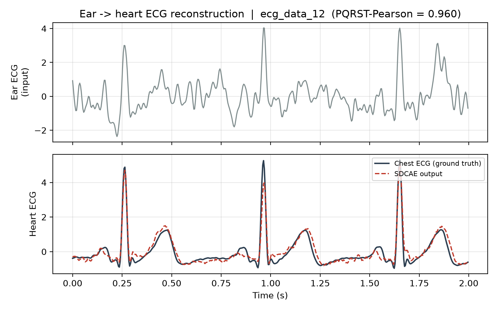
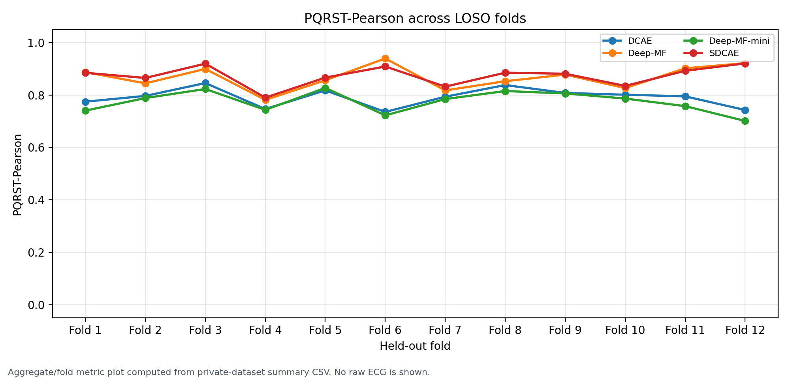

# Ear-to-Chest ECG Reconstruction with SDCAE

This repository presents an offline research benchmark for reconstructing
chest-reference ECG morphology from single-ear ECG. It is not a diagnostic
system, not an arrhythmia detector, and not a medical device. The private paired
dataset is not publicly released. Public reproducibility is limited to
code-level and pipeline-level demonstration using synthetic or sample data. Full
benchmark reproduction requires authorized local access to the private dataset.

## Result Figures

The reconstruction figure below is an example from a private LOSO benchmark
run. It shows the ear ECG input, the SDCAE reconstruction, and the
chest-reference ground truth for one held-out window. It is included as a visual
summary only; raw subject-level ECG recordings are not publicly released and the
output is not clinical ECG.



The fold plot below summarizes PQRST-Pearson across the 12 private LOSO folds
using anonymized fold labels. It shows aggregate/fold metrics only and does not
show raw ECG.



## What This Project Is

- An offline research benchmark for reconstructing chest-reference ECG
  morphology from single-ear ECG.
- A subject-independent evaluation workflow when LOSO is run on the authorized
  private dataset.
- A morphology-aware evaluation pipeline using P/QRS/T masks and PQRST-Pearson
  metrics.
- A comparison of SDCAE against full-precision reconstruction baselines.

## What This Project Is Not

- Not a diagnostic system.
- Not a medical device.
- Not an arrhythmia detector.
- Not a replacement for clinical ECG.
- Not a real-time wearable deployment unless causal filtering, streaming
  inference, latency/memory profiling, and signal-quality failure handling are
  implemented and reported.

## Reproducibility Scope

The full paired ear-ECG/chest-reference ECG dataset is not publicly released due
to participant privacy and data-governance constraints. This repository supports
code-level and pipeline-level demonstration using synthetic or anonymized sample
data. Full LOSO benchmark reproduction requires authorized local access to the
private dataset. Reported benchmark results are released only as aggregate
metrics.

## Dataset Provenance

The private paired ear-ECG/chest-reference ECG dataset used for the reported
aggregate benchmark was collected by
[EDABK Research Lab](https://sites.google.com/set.hust.edu.vn/hust-edabk-lab/),
School of Electrical and Electronic Engineering, Hanoi University of Science and
Technology (HUST). The EDABK web page is provided to identify the collecting
lab; it is not a public data-release page, and the raw subject-level ECG
recordings remain private.

## Data Release Boundary

Public:

- code and configuration files;
- documentation;
- smoke/demo scripts;
- aggregate tables and metrics;
- synthetic/sample data for pipeline demonstration.

Private:

- raw full ECG recordings;
- subject-level paired recordings;
- preprocessing caches derived from private recordings;
- private checkpoints or logs unless release rights are documented.

See [DATA_STATEMENT.md](DATA_STATEMENT.md) and [DATA_ACCESS.md](DATA_ACCESS.md)
for the data governance boundary.

## Offline vs Deployment Boundary

The current pipeline is an offline supervised benchmark. Zero-phase filtering,
chest-reference-derived masks, and chest-reference preprocessing are valid for
offline evaluation only. Deployment would require causal filtering, ear-only
inference, streaming windows, latency and memory measurements, and
signal-quality failure handling.

## Dataset Schema

The private loader currently expects a data root containing headerless
two-column CSV files:

```text
ecg_data_01.csv
ecg_data_02.csv
...
```

| Column | Signal | Role |
| --- | --- | --- |
| 0 | Ear ECG | input `x` |
| 1 | Chest-reference ECG | target `y` |

Synthetic demo data uses the same file shape so public smoke runs exercise the
same loading and preprocessing path. Synthetic data is not participant data and
must not be used for scientific claims.

## Segments Used

In this repository, one segment means one 500-sample window, equal to 2 seconds
at 250 Hz.

For the current private LOSO protocol:

- training and validation windows use 90% overlap;
- held-out test windows use 50% overlap;
- the private processed cache produced 35,516 aggregate candidate windows at
  90% overlap;
- the private processed cache produced 7,107 aggregate candidate windows at
  50% overlap;
- each LOSO fold uses roughly 29,283 to 29,394 training windows, 2,939 to 3,289
  validation windows, and 567 to 658 held-out test windows.

These are aggregate protocol counts computed from the private dataset. Raw
recordings and subject-level sample counts are not publicly released.

## Quickstart Without Private Data

```bash
pip install -r requirements.txt
python scripts/make_synthetic_data.py --output data/synthetic/demo
python scripts/run_smoke_demo.py --data-root data/synthetic/demo --output-dir outputs/smoke_demo
```

The smoke demo loads synthetic data, preprocesses it, windows it, runs a model
forward pass, computes basic metrics, and writes small artifacts under
`outputs/smoke_demo/`, including `reconstruction_demo.png` with ear input,
model output, and chest-reference ground truth. It is not a benchmark.

## Full Benchmark With Private Data

Place the authorized private dataset under `data/private/`, or pass an explicit
path:

```bash
python scripts/run_loso.py --config configs/loso.yaml --data-root /path/to/authorized/private_dataset --output-dir outputs/loso
```

If private data is missing, the benchmark exits with a clear message instead of
falling back to synthetic data.

## Main Aggregate Results

The aggregate results below were computed on the private dataset. They are
reported here for traceability only; the full subject-level recordings are not
publicly released.

Training objective:

```text
FinalECGCombinedLoss with lambda=1.0, beta=10.0, gamma=5e-8, alpha=0.0, other_loss=0
```

Because `other_loss=0`, the effective objective is pure MSE.

Accuracy:

| Model | PQRST mean +/- std | Full r | MSE | Best PQRST |
| --- | ---: | ---: | ---: | ---: |
| **SDCAE (ours)** | **0.873 +/- 0.039** | **0.862** | **0.257** | 0.921 |
| Deep-MF | 0.867 +/- 0.046 | 0.849 | 0.276 | **0.939** |
| DCAE | 0.791 +/- 0.036 | 0.783 | 0.436 | 0.846 |
| Deep-MF-mini | 0.775 +/- 0.041 | 0.766 | 0.456 | 0.827 |

Model footprint:

| Model | Params | Weight format | Size vs SDCAE |
| --- | ---: | --- | ---: |
| **SDCAE (ours)** | 23,140 | **11.3 KB**, packed 4-bit | 1.0x |
| Deep-MF | 13,243 | 51.7 KB, fp32 | 4.6x |
| DCAE | 61,345 | 239.6 KB, fp32 | 21.2x |
| Deep-MF-mini | 13,555 | 52.9 KB, fp32 | 4.7x |

The conservative conclusion is that SDCAE matches the strongest full-precision
baseline in aggregate while using a smaller theoretical packed weight footprint.
The reported SDCAE size is not a measured embedded runtime memory footprint.

## Metrics

Primary metric: PQRST-Pearson, computed over the contiguous P-to-T complex using
masks derived from the chest-reference ECG for offline evaluation.

Additional metrics:

| Metric | Meaning |
| --- | --- |
| Full Pearson | correlation over the full 2-second window |
| MSE | mean squared reconstruction error |
| RMSE | root mean squared reconstruction error |
| SNR | signal-to-noise ratio |
| R2 | coefficient of determination |
| PRD | percent root-mean-square difference |

## Models

SDCAE is the proposed compact model: a 1D convolutional autoencoder with 4-bit
LSQ quantized convolution and transposed-convolution layers plus integer
multi-level spike activations.

Baselines:

- Deep-MF: full-precision baseline inspired by ear-ECG matched-filter work.
- Deep-MF-mini: smaller full-precision baseline inspired by lightweight
  single-ear ECG reconstruction work.
- DCAE: full-precision denoising convolutional autoencoder baseline.

## Loss Functions

`FinalECGCombinedLoss` computes:

```text
total = lambda * MSE + beta * Perceptual + gamma * TV + alpha * PearsonLoss
```

With `other_loss=0`, the perceptual, total-variation, and Pearson terms are
disabled and ECGFounder is not required. With `other_loss=1`, a local trusted
ECGFounder checkpoint is required for perceptual loss.

`MSEPearsonLoss` is the lightweight alternative:

```text
total = lambda * MSE + alpha * (1 - Pearson)
```

## Result Traceability

- Aggregate public results were computed on the private dataset.
- Subject-level raw ECG signals are not released.
- Subject-level or fold-level result files should remain private unless release
  approval is documented.
- Existing local files under `results/metrics/`, `results/optuna_*`, and
  per-subject figures may contain private-run trace data; see
  [docs/privacy_audit.md](docs/privacy_audit.md).
- Do not change reported numbers unless the benchmark is actually rerun.

Aggregate tables can be rebuilt from a private summary CSV:

```bash
python scripts/build_paper_artifacts.py --summary-path outputs/loso/metrics/loso_summary.csv --output-dir outputs/paper_artifacts
```

An anonymized fold-level Pearson plot can be generated from a private summary
CSV without showing raw ECG or subject IDs:

```bash
python scripts/plot_fold_pearson.py --summary-path results/metrics/loso_summary.csv --output outputs/figures/fold_pearson.png
```

Per-subject figures are opt-in and should remain private:

```bash
python scripts/build_paper_artifacts.py --summary-path outputs/loso/metrics/loso_summary.csv --output-dir outputs/paper_artifacts --include-per-subject-figure
```

## Repository Layout

```text
CodeX/
  configs/
    loso.yaml
  data/
    README.md
    private/.gitkeep
    sample/README.md
    synthetic/README.md
  docs/
    privacy_audit.md
  scripts/
    README.md
    build_paper_artifacts.py
    make_synthetic_data.py
    plot_fold_pearson.py
    plot_reconstruction.py
    run_loso.py
    run_smoke_demo.py
    tune_loss_optuna.py
    tune_mse_pearson_optuna.py
  src/
    data/
    models/
    training/
  DATA_ACCESS.md
  DATA_STATEMENT.md
  requirements.txt
```

## References

- Deep-MF: **A Deep Matched Filter for R-Peak Detection in Ear-ECG**,
  arXiv:2305.14102.
- Deep-MF-mini: **Real-Time, Single-Ear, Wearable ECG Reconstruction, R-Peak
  Detection, and HR/HRV Monitoring**, arXiv:2505.01738.
- DCAE: **In-ear ECG Signal Enhancement with Denoising Convolutional
  Autoencoders**, arXiv:2409.05891.
- LSQ quantization: **Learned Step Size Quantization**, arXiv:1902.08153.
